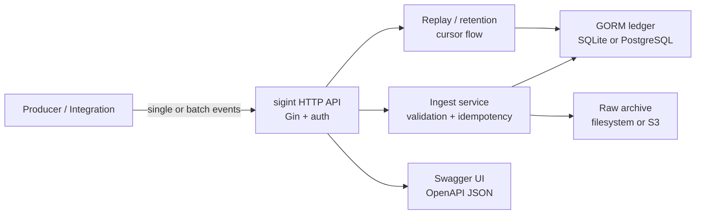

# sigint

> Events in, durable facts out.

`sigint` is a Go API and CLI for collecting immutable event facts, validating their hashes, storing the raw envelope, replaying accepted events, and giving operators a boring set of knobs that work locally and in production-like environments.

It is a generic events ingest service with GORM persistence, SQLite for local use, PostgreSQL for production-shaped use, generated OpenAPI docs, standalone Docker Compose, and `sigint` / `SIGINT` naming everywhere.

## What This Service Owns

| Capability | What it means here |
| ---------- | ------------------ |
| HTTP API | Gin routes for health, readiness, event ingest, batch ingest, lookup, replay, and generated Swagger docs |
| CLI | Cobra commands for server lifecycle, DB init, file ingest, event lookup/replay, retention, and diagnostics |
| Persistence | GORM models with SQLite and PostgreSQL adapters |
| Raw archive | Filesystem storage for local development and S3-compatible storage for production-shaped runs |
| Replay | Cursor-based replay for stored events, with filters and configurable limits |
| Retention | Cursor-confirmed deletion of hot stored records after downstream confirmation |
| Documentation | Swaggo-generated docs served at `/v1/docs/swagger/index.html` and `/openapi.json` |
| Local operations | `Makefile`, `Dockerfile`, `.air.toml`, standalone `docker-compose.yaml`, sample configs, and smoke targets |

## Architecture



Core behavior:

- duplicate event IDs are accepted as duplicates when the canonical event hash matches
- duplicate event IDs with different event hashes are conflicts when hash conflict rejection is enabled
- payload and event hashes are lowercase SHA-256 strings
- the raw envelope is preserved for lookup and replay
- readiness checks exercise the configured ledger and storage adapter

## Repository Layout

```text
cmd/sigint/       CLI entrypoint and Swaggo root annotations
docs/             OpenAPI output, constitution, specs, and repo guidance
examples/         local, compose, production, and sample event payloads
internal/api/     Gin router, controllers, auth, debug, and route tests
internal/cli/     Cobra command tree and operator workflows
internal/config/  YAML config loading, env expansion, and validation
internal/events/  event envelope contract, hashes, replay query types
internal/ingest/  ingest, duplicate handling, retention, and service tests
internal/ledger/  GORM SQLite/PostgreSQL ledger implementation
internal/runtime/ app wiring for config, ledger, storage, and ingest service
internal/storage/ filesystem and S3 raw-envelope archives
```

## API Surface

| Method | Route | Purpose |
| ------ | ----- | ------- |
| `GET` | `/` | Redirect to Swagger UI |
| `GET` | `/llms.txt` | LLM-friendly Markdown service index |
| `GET` | `/v1/docs/swagger/index.html` | Swagger UI |
| `GET` | `/openapi.json` | Generated OpenAPI JSON |
| `GET` | `/healthz` | Lightweight liveness |
| `GET` | `/readyz` | Dependency readiness |
| `POST` | `/v1/events` | Ingest one event |
| `POST` | `/v1/events:batch` | Ingest a batch with per-event results |
| `GET` | `/v1/events/:event_id` | Fetch one stored event record |
| `GET` | `/internal/v1/events/replay` | Replay stored events by cursor and filters |

When configured, producer routes use `Authorization: Bearer <SIGINT_PRODUCER_TOKEN>` and internal replay uses `Authorization: Bearer <SIGINT_INTERNAL_TOKEN>`.

Set `SIGINT_ENV=debug` to expose local debug routes under `/debug`.

## Local Development

Prerequisites:

- Go `1.25+`
- Docker and Docker Compose for container/profile workflows
- `swag` is run through `go run`, so no global install is required

Common commands:

```bash
make help
make docs
make build
make db-init
make run
make smoke
make check
```

Default local config is `examples/config.local.yaml`, which uses:

- SQLite ledger at `var/ingest.sqlite`
- filesystem raw archive at `var/event-lake`
- host `127.0.0.1`
- port `8920`

Run a local server:

```bash
make db-init
make run
```

Post the bundled sample event:

```bash
make post-event
```

Inspect the docs:

- Swagger UI: `http://127.0.0.1:8920/v1/docs/swagger/index.html`
- OpenAPI JSON: `http://127.0.0.1:8920/openapi.json`

## Docker Compose

The compose file is standalone for this repo:

```bash
docker compose config --services
docker compose up -d
```

Optional profiles provide production-shaped dependencies without making them mandatory:

```bash
docker compose --profile postgres --profile localstack config --services
docker compose --profile postgres up -d postgres
docker compose --profile localstack up -d localstack
```

`examples/compose.config.yaml` keeps the app container local and filesystem-backed by default. `examples/production.config.yaml` shows PostgreSQL plus S3-compatible storage using `SIGINT_*` environment variables.

## Validation

Use the full local check before delivery:

```bash
make check
make smoke
docker compose config --services
```

Useful focused checks:

```bash
go test ./...
go vet ./...
make docs
make test-postgres
make test-s3-localstack
make smoke-production-profile
```

The Postgres, LocalStack, and production-profile targets require Docker to be running.
